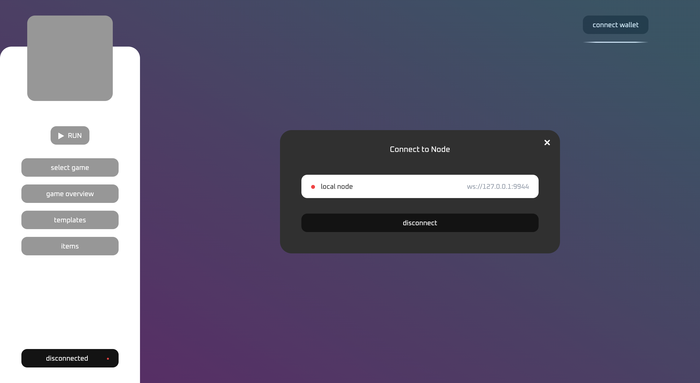
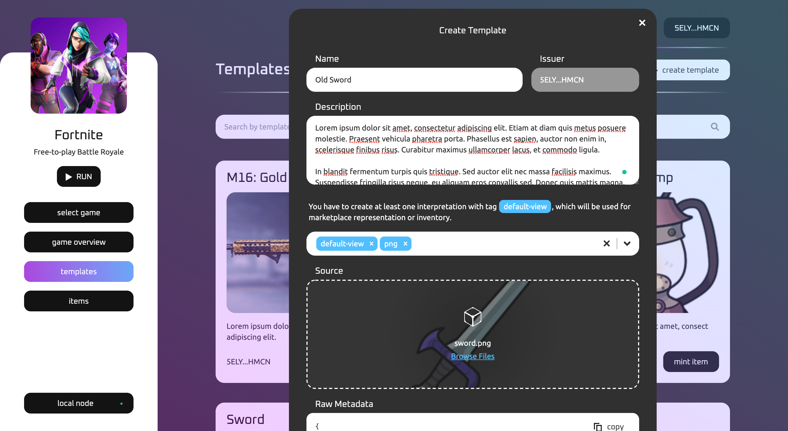
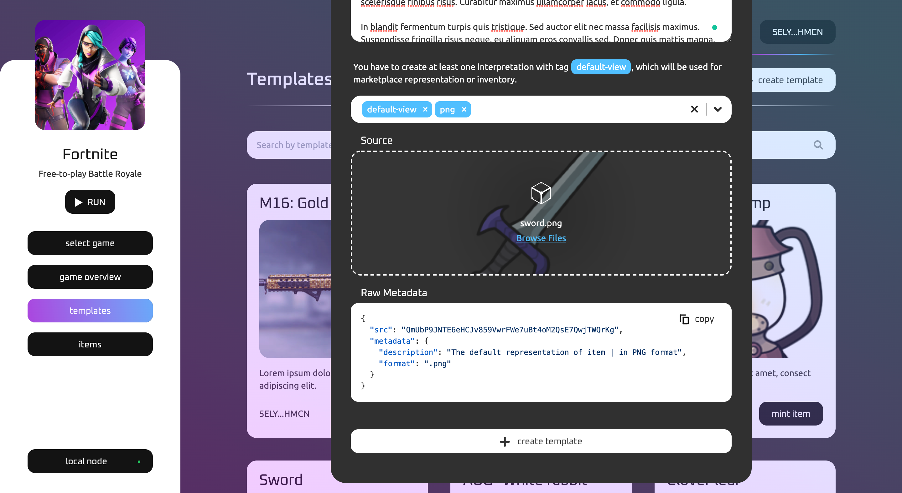
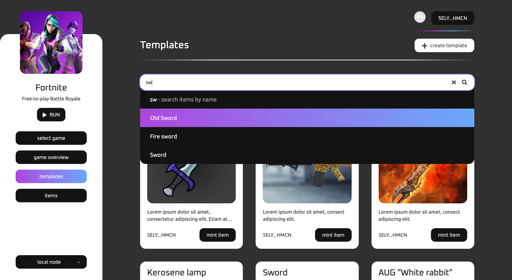
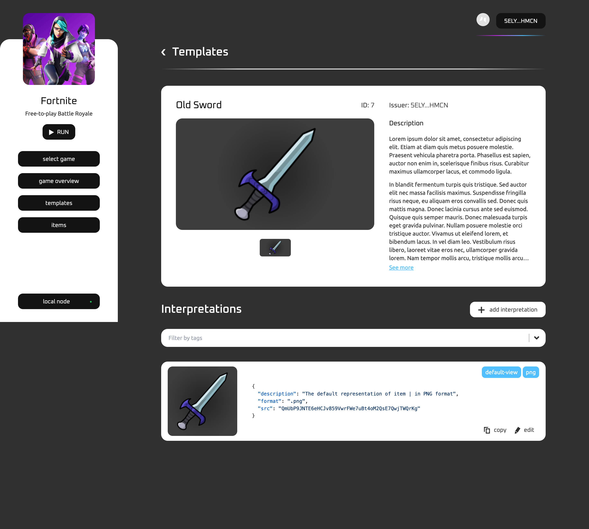
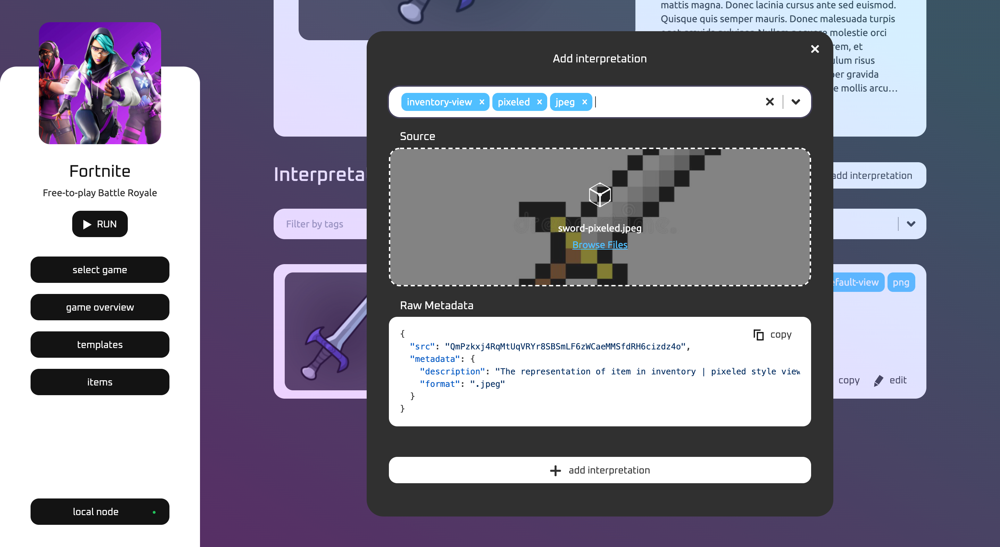
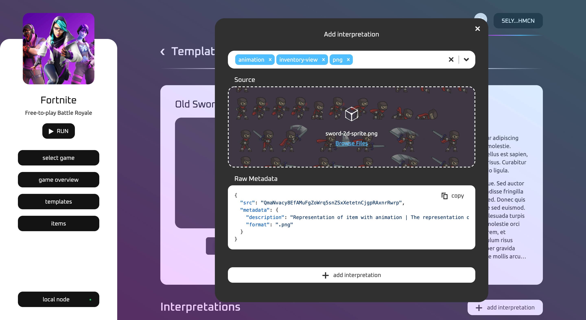

# Game Developers Console Testing Guide

Firstly, you have to configure the local env and run three processes:
1. Asylum node
2. Local IPFS daemon
3. Game Developers Console web app

Follow instructions to run [Game Developers Console (locally)](/packages/game-developers-console/README.md).
Make sure you're using the node version: **v17.9.0**.

### Steps

#### Step 1: Seed mock data for your local node


1. Create `.env.local` file in `packages/connection-library` with the following content (you can specify any `SEEDER_MNEMONIC`):
```
SEEDER_MNEMONIC = eternal danger cherry radar exit damage slam hip say relief awesome middle
ENDPOINT_URL = ws://127.0.0.1:9944
```

2. Navigate to the root directory and run `seed` script to configure testing data on local node:
```
yarn seed
```

#### Step 2: Configure PolkadotJS and connect to the local node:

1. [Install](https://polkadot.js.org/extension/) PolkadotJS browser extension.

2. Import seeder account using `SEEDER_MNEMONIC`.

3. Navigate to `http://localhost:3000` in the browser:

4. Click `disconnected` button and connect to the local node:
   

5. Click `connect wallet` button -> Select `Polkadot{.js} wallet` -> Select seeder account, which you imported before
   

6. After that, you will see the list of games associated with the seeder account.
   

7. You can click `game overview` button and check game metadata, which is configured by the seed script
   

#### Step 3: Configure Template and Interpretations:

1. Navigate to the `templates` page and click `+ create template` button. Here you have to fill in metadata related to the Template (`Name`, `Description`). All Templates should have at least one visual Interpretation with `default-view` tag. This Interpretation can be used in the marketplace or inventory and represents the general visual features of Template.
> Note: at the moment, the form works only with `image/*` sources, but in fact, Interpretation can have any source type, even not visual, but text



2. Adding Tags affects the metadata of Interpretation. You can check the result in `Raw Metadata` field. Consider tags as a verbal description of Interpretation. Tags can carry metadata fields with predefined or configurable values, or even without any metadata, bringing specific semantics to the Interpretation (like the `pixeled` tag).
   

3. After submitting Template and signing a transaction, you can find the Template using the search bar
   

4. Click on the Template and check its metadata and Interpretations. You can add new Interpretation to the Template or edit the existing one.
   

5. Let's add a new Interpretation with `pixeled tag`.
> Note: after submitting the change-set Template proposal, you'll be passed through the DAO acceptance process. Right now, the flow is simplified, and it's implied that DAO always accepts the proposal. Anyway, there will be two transactions:
> 1. Create change-set proposal
> 2. Applying updates to the Template



6. Finally, the new Interpretation was added!
   


